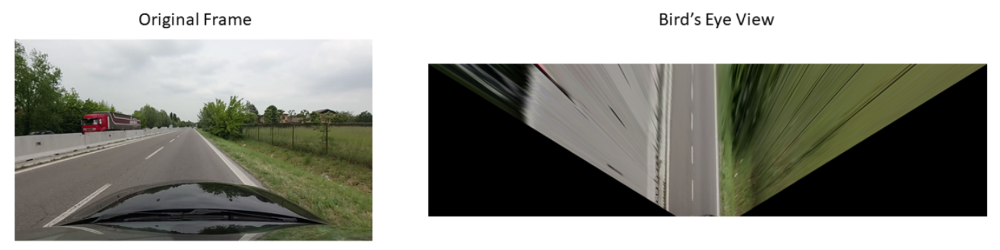
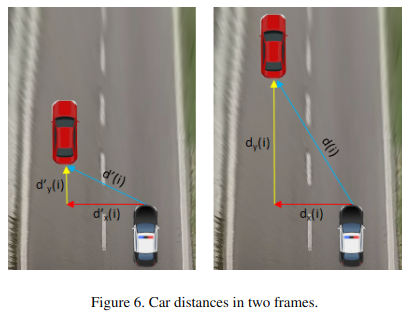
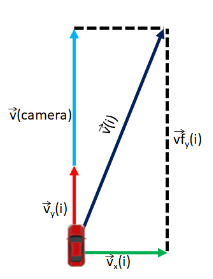

# ROAD OBJECT TRACKER AND CAR SPEED DETECTOR
This is a project that me and my university collegue [Gianluca Maugeri](https://github.com/gianlucamaugeri) developed during our Master's Degree in Computer Engineering at the University of Modena and Reggio Emilia.

While this is a class project, there are some interesting features that might be useful. In particular, we were able to (effectively) track the speed of the cars in the scene, given just the speed of the recording camera and the dimensions of the hood of the reference car.

Nevertheless, the goals of the project were multiple:
- Segment the video frames
- Detect the object on and off the road
- Track the other cars
- Detect the speed of the other cars, given the current speed of the reference car (the one onto which the camera is installed).

The entire work is based on the DR(eye)VE dataset available here: [dataset page](https://aimagelab.ing.unimore.it/imagelab/page.asp?IdPage=8) 

**DISCLAIMER #1: This is a Master's Degree class project, and such was its only purpose. Surely, there are thousands of better ways to do this kind of project. Moreover, it dates back to 2019 (perhaps even 2018). Hence, the pretrained model employed here are certainly obsolete! Eventually, I will update everything, but the process will certainly take a long time (feel free to fork and change any dumb line of code that we wrote back in the days!)**

### EXAMPLE OUTPUT
[](https://www.youtube.com/watch?v=G6mmCd5I_4E)

### HOW IT WORKS
The segmentation of the scene and detection of the tracked object are straightforward operations. We simply pass the current frame to two different Deep Learning models (DL) already trained to complete the task.

In particular, we use DeepLabV3 ([Original Code](https://github.com/fregu856/deeplabv3)) and Yolov3 ([Original Code](https://github.com/pjreddie/darknet)). Similarly, we use SORT ([Original Code](https://github.com/abewley/sort)) for tracking. These models were ok at the time we wrote the code, but they are very much obsolete today.

The originality of our work lies in the speed detection part. 

Since the camera is in motion, it is necessary to have the speed of our egocentric camera noted, in order to evaluate the absolute speed of the moving objects. Luckily, the DR(eye)VE dataset provides this information in a text file for each
video.

Hence, our workflow proceeds as follows:
1. PROJECTION: We project the entire scene in a bird-eye view
2. PIXEL DISTANCE: We compute the distance (in pixel) from the camera to the objects
3. METER DISTANCE: We convert the pixel distance in meters in the real world
4. SPEED COMPONENTS: We obtain the x and y components of the speed
5. FINAL SPEED: We combine the two components to obtain the final speed.

#### PROJECTION
In order to find the pixel distance, we need to deal with perspective.
This is simple to do if you have the camera parameters, but this is not the case. 

Hence, we use homographies ([OpenCV tutorial](https://docs.opencv.org/4.x/d9/dab/tutorial_homography.html)). 
Basically, a planar homography is a transformation that projects the points of a plane seen by a camera, as they would have been seen by another camera in a different position.
In particular, we aim at transforming the frame captured by our camera, to another in a bird-eye view. An clarifying example is in the Figure below.



Our idea is simple: if we are able to obtain the Bird's eye view of the street and of every object on it, then we won't be bothered by persepective, and the distances between will be easy to compute.

Avoiding all the mathematical details, we have to find the elements of the matrix H (3x3) that let us solve:
$$
\begin{bmatrix}
t_i x'_i \\\ t_i y_i' \\\ t_i
\end{bmatrix}
= H \cdot
\begin{bmatrix}
x_i \\\ y_i \\\ 1
\end{bmatrix}
$$
where $x_i, y_i$ are the coordinates of a point in the original plane, while $x_i', y_i'$ are the coordinates in the destination plane.

To perform this kind of operation we require to find out the coordinates of a quadrangle vertices in the source frame (the normal view of the street from our camera) and the coordinates of the corresponding quadrangle vertices in the destination image (the bird’s eye view).

We choose the points manually in a way that the lines of the street become parallel in the view from above.

**DISCLAIMER #2: To be extremely precise this process of choosing the source and destination points should be done for each video. In this case, it would be required to find different points for each video. However, for the sake of simplicity and since the inclination of the camera attached to the car is pretty much the same in all the videos, we used the same matrix for all the clips. Even with this strong assumption the results we obtained are pretty much satisfying with all the videos of the dataset we tried.**

At the end of this process, we obtain the birds' eye view of the street, and we can proceed with the second phase.

#### PIXEL DISTANCE
After having obtained the birds' eye view of the street, we can proceed computing the distance from the reference camera to the cars on the street.

As reference point from which estimate all the distances, we choose the center $c$ of the
upper end of the hood of our car. For the moving objects instead, we choose as reference point the middle of the base of its bounding box found in the detection step. The distance for the object $i$ (in pixels, in the bird’s eye view frame) is then computed in this way:
$$
d_x[i] = x[i] - x[c]; 
$$
$$
d_y[i] = y[i] - y[c]
$$
where $x[i]$ is the pixel coordinate of the object $i$ in the bird's eye view.

#### METER DISTANCE
To obtain the distance in meters, we need to compute the ratio meter-per-pixel in the bird's eye view. Luckily, we were given the measure in meters of the hood of the car. So our computation was pretty easy. 

Ratio m/px: 0.09717

#### SPEED COMPONENTS
To obtain the speed of the cars in the scene, we suppose that they move at a constant speed between two consecutive frames. 

Hence, given a tracked car, we can simply compute the speed components (in m/s) on the x and y axis using the following formula:
$$
v_x(i) = \frac{d_x(i) - d'_x(i)}{1/FPS}
$$
$$
v_y(i) = \frac{d_y(i) - d'_y(i)}{1/FPS}
$$
where $d(i)$ refers to the distance of the object at the current frame, while $d'(i)$ refers to the previous frame (see Figure below).



Nevertheless, computing speed at each video frame turned out to be very imprecise. Hence, to smooth the computation, we evaluate the speeds each `<min_frames>` number of frames, under the assumption that the object moves at a constant speed during this small fraction of time. Note that `<min_frames>` is a parameter that can be changed at runtime (see the [HOW TO EXECUTE](#how-to-execute) section).

The final formulas become:
$$
v_x(i) = \frac{d_x(i) - d'_x(i)}{min\_frames/FPS}
$$
$$
v_y(i) = \frac{d_y(i) - d'_y(i)}{min\_frames/FPS}
$$

In addition, to obtain the final speed $v^f$, we need to add to the y component of the speed, the speed of our camera.
$$
v^f_y(i) = v_y(i) + v(camera)
$$
This is possible because the dataset provide the $v(camera)$ at each timeframe.

#### FINAL SPEED
The final value of the speed can be computed summing the two components as in the figure below



Moreover, in order to make our results more robust, we use the mean between the speeds we find in two consecutive frames as the displayed result.


### BEFORE THE EXECUTION:
Make sure you have installed the libraries present in requirements.txt.


### CODE STRUCTURE
Files:
- object_tracker.py: main file to execute.
- models.py: contains the network model for the detection
- moving_object.py: contains the MovingObject class
- sort.py: The SORT algorithm: Original code on: https://github.com/abewley/sort
- evaluation.py: Contains the code for the evaluation of segmentation.

Directories:
- config: Contains the configuration file of yolov3. https://github.com/pjreddie/darknet
- eval: contains the prediction frames and its respective hand-labeled groundtruth frame for evaluation purposes (see evaluation.py)
- pretrained_models: contains the pretrained DeepLabV3 and ResNet used in segmentation.
- segmentation_models: contains the implementation of DeepLabV3 architecture. Original Code on: https://github.com/fregu856/deeplabv3
- utils: contains utilities for the code.
- videos: directory where dataset videos should be put.
	  It contains 2 Dr(eye)ve example: 02 and 11 with its corrispective output (30 seconds each).


### HOW TO EXECUTE:
```python object_tracker.py [-p <path-to-video-directory>][-fps <fps>][-mf <minframes>][-sb <seconds-to-wait>][-se <seconds-to-end>]```

Options:
- `p <path>`: optional. Default 'videos/02/'. It specifies the path of the video directory (example: videos/02/).	NB: video_garmin.avi and speed_course_coord.txt are required in the selected directory, otherwise the program won't work. These names and extensions of the files are mandatory (they are the same as provided in DR(eye)VE dataset).

- `-fps <fps>`: optional. Default = 25. Frame per seconds of the video in input.

- `-mf <minframes>`: optional. Default = 10. Number of frames for the speed sampling.

- `-sb <seconds-to-wait>`: optional. Default = 0. This specifies how many seconds of the video should not be included in the analysis. SHOULD BE LOWER THAN 300 and LOWER THAN `se` argument if specified.

- `-se <seconds-to-wait>`: optional. Default = 300. This specifies how many seconds of the video to include in the analysis starting from `sb`. SHOULD BE LOWER or EQUAL THAN 300 and HIGHER THAN `sb`.

The outputs of the model are located in the same directory specified by `-p` argument:
- video_garmin-det.avi is the output of the detection phase with speed evaluation of moving objects and position evaluation of objects on the road
- video_garmin-seg.avi is the output of the segmentation phase.
